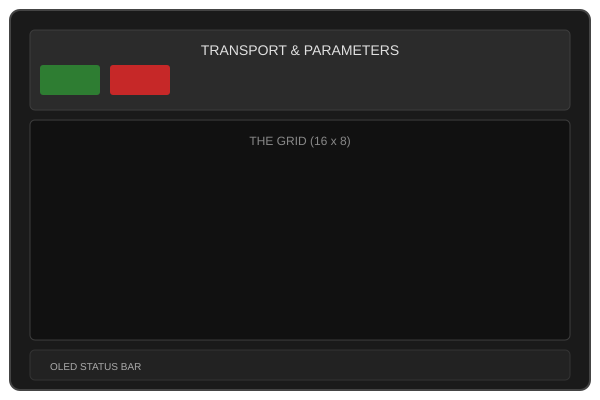
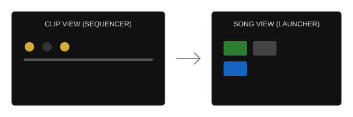

# ChucK-Java Deluge User Guide

Welcome to the digital edition of the Synthstrom Audible Deluge, powered by ChucK-Java. This application replicates the workflow and soul of the Deluge hardware within a high-performance JavaFX environment.

---

## Table of Contents
1. [Hardware Overview](#1-hardware-overview)
2. [Getting Started](#2-getting-started)
3. [Clip View](#3-clip-view)
4. [Song Mode](#4-song-mode)
5. [Arranger Mode](#5-arranger-mode)
6. [Sound Design](#6-sound-design)
7. [Advanced Features](#7-advanced-features)
8. [Current Limitations](#8-current-limitations)

---

## 1. Hardware Overview

The Deluge UI is divided into four primary interactive zones:

### Transport & Modes
*   **▶ PLAY / ■ STOP**: Controls the global transport.
*   **VIEW MODES**: Toggle between **CLIP** (Sequencing), **SONG** (Launching), and **ARR** (Arranging).
*   **TEMPO / SWING**: Adjustable sliders for the global clock.

### The Matrix
The heart of the Deluge. An 8-row by 16-column grid used for entering notes, launching clips, or visualizing the timeline.

---

## 2. Getting Started

### Playback
Click **▶ PLAY** in the top transport panel. The playhead (highlighted column) will begin moving across the grid. Use **■ STOP** to reset the playhead to the beginning.

### Global Parameters
*   **Tempo**: Drag the **TEMPO** slider to adjust BPM (60 - 200).
*   **Swing**: Drag the **SWING** slider to add "groove" to your patterns. 50% is straight, >50% pushes even 16th notes.
*   **Master Vol**: Controls the final output level of the ChucK engine.

---

## 3. Clip View

Clip view is where you create your patterns. The grid is split into **Kit** tracks and **Synth** tracks.

### Track Layout
*   **Rows 1-4**: Drum Kit tracks (Kick, Snare, HiHat, Open Hat).
*   **Rows 5-8**: Polyphonic Synth tracks.

### Sequencing
*   **Left Click**: Toggle a note on (Track Color) or off (Dark).
*   **Right Click**: Open the **Step Editor** popover to adjust Velocity, Gate length, and Probability.
*   **Shift + Right Click (Synth only)**: Open the **Note Entry** popover to select a specific pitch for that step.
*   **Audition**: Click the square **Audition Pad** on the far left of any row to hear the sound instantly.
*   **Configuration**: Click the **⚙ (Gear)** icon to open the Track Settings.

---

## 4. Song Mode

Accessed by clicking the **SONG** toggle. In this mode, the matrix transforms from a step sequencer into a **Clip Launcher**.

### Launching Clips
*   Each row represents a track.
*   The colored blocks represent saved clips/patterns.
*   Click a block to "queue" it for the next bar.
*   The Deluge uses **Launch Quantization** to ensure all clips stay in sync.

---

## 5. Arranger Mode

Accessed by clicking the **ARR** toggle. Arranger mode provides a linear "DAW-style" timeline of your entire track.

### Timeline Navigation
*   Horizontal axis represents time (Bars/Beats).
*   Vertical axis represents tracks.
*   You can see exactly when clips are triggered and how long they play.

---

## 6. Sound Design

Click the **⚙** icon on any track to dive into the engine.

### Synth Engine
*   **Oscillators**: Choose between Sine, Saw, Square, Triangle, and Analog-modeled waveforms.
*   **Filter**: State Variable Filter (SVF) with Lowpass, Highpass, and Bandpass modes. Adjustable **Cutoff** and **Resonance**.
*   **Envelopes**: Exponential Attack/Decay/Sustain/Release. *Currently supporting Attack adjustment via UI.*

### Kit Engine
*   **Sample Selection**: Open the **Browser** to load custom `.wav` files into any drum slot.
*   **Pitch**: Shift the sample pitch by +/- 24 semitones.

---

## 7. Advanced Features

### Loading Hardware Files
The Java edition can parse official Deluge `.XML` files!
1.  Click **📂 LOAD XML** in the transport panel.
2.  Select a Synth or Kit XML file from your Deluge SD card.
3.  The app will attempt to map parameters to the ChucK engine.

### Debugging
Click the **🐞 DEBUG** button to enable real-time audio tracing in the console. This shows which UGens are active and their current output levels.

---

## 8. Current Limitations

While the Java edition is powerful, some hardware features are currently in development. Understanding these gaps will help you plan your patches:

| Hardware Feature | Current Status | Workaround / Detail |
| :--- | :--- | :--- |
| **Polyphony** | Limited | 4-voice polyphony for synths; 4-track monophonic kits. |
| **Oscillators** | Single | Each synth voice uses one `MorphingWavetable` (Sine/Saw transition). |
| **Resampling** | Not Possible | Use external system recording. |
| **FM Synthesis** | Not Possible | Native ChucK `SinOsc` FM patches are not yet wired to the UI. |
| **Probability** | Engine only | Logic exists in ChucK but lacks UI toggles per step. |
| **Automation** | Linear only | Use UI sliders; recording "gold knob" movements is not yet supported. |
| **Unison** | Not Possible | Single voice per synth track in the current `engine.ck`. |
| **Sidechain** | Not Possible | Global `Dyno` limiter on the master bus provides compression but no ducking input. |
| **Effects** | Global Only | Delay and Reverb are shared across all tracks. |
| **Multisampling** | Not Possible | Each kit row supports one sample only. |
| **Undo / Redo** | Model only | Logic exists in code but lacks UI buttons/shortcuts. |
| **Midi Out** | Experimental | Basic routing available in `org.chuck.deluge.midi`. |

---

*Manual version 1.1 — April 2026*
