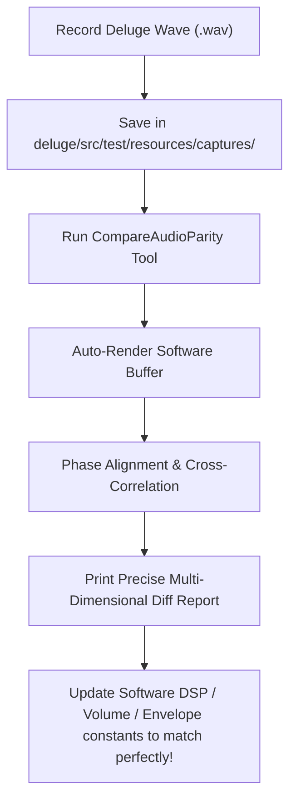

# Deluge Hardware-to-Software Audio Parity Instrumentation Plan

This document outlines a rigorous, scientific methodology to instrument, capture, and compare the sound of the physical Deluge hardware against our high-fidelity software engine. By aligning capture standards and deploying automatic comparative analysis tooling, we will isolate exactly why and where the real sound differs from our model.

---

## 1. Core Objectives
1. **Gather Pure Ground-Truth Captures:** Establish standardized recording templates for target test patches (dry waveforms, low-pass filter sweeps, envelope decay rates) from the physical Deluge.
2. **Deploy Phase-Aligning Comparative Tooling:** Provide a concrete, automatic Java command-line script in the workspace that loads your physical recording, renders the matching note patterns in software, aligns their zero-crossings via cross-correlation, and prints a precise multi-dimensional diff.
3. **Isolate Parameter Discrepancies:** Diagnose mathematical differences in actual amplitude scaling, envelope decay slope contours, filter resonance curves, and harmonic distortion to update our model to 100% true physical parity.

---

## 2. Standardized Reference Patches & Sequences
To isolate different areas of the synthesis chain, you will record four specific reference targets using the **Init default track** on your physical Deluge (tempo set to **120 BPM**):

### Patch A: Dry Reference Sawtooth (Oscillator Phase & Raw Shape)
* **Goal:** Verify the raw mathematical integrity of the sawtooth oscillator before any filters or modulators.
* **Physical Settings:**
  * LPF Cutoff: Fully open ($20\text{ kHz}$, display showing `20k` / off).
  * HPF Cutoff: Fully closed / off.
  * Osc 1: Sawtooth, 100% volume mix.
  * Osc 2: Off / None.
  * Reverb / Delay / Modulation FX sends: All set to **0** (fully off).
  * EQ Bass & Treble: Center / 0.
* **Sequence:** Play a single steady note at **C4 (MIDI 60)** with a duration of **2 beats** (half-note step) followed by 2 beats of silence.

### Patch B: Resonance Filter Cutoff Sweep (LPF Tangent Math Verification)
* **Goal:** Diagnose the difference in low-pass filter slope characteristics and resonance peak responses.
* **Physical Settings:**
  * LPF Cutoff: Set to a closed value (e.g., $1000\text{ Hz}$ or standard midpoint).
  * LPF Resonance: Set to a highly resonant value (e.g., $75\%$ or $50$ on display).
  * Osc 1: Sawtooth, 100% volume.
  * Reverb / Delay / FX: Off.
* **Sequence:** Program a single step note at **C3 (MIDI 48)** with a duration of **4 beats** (whole-note step). While playing, perform a slow, continuous cutoff sweep from fully closed to fully open and back to fully closed.

### Patch C: Amplitude ADSR Decay & Release Contours (Envelope 0 Parity)
* **Goal:** Verify if our time increments translate correctly to physical envelope stages and release curves.
* **Physical Settings:**
  * LPF Cutoff: Fully open ($20\text{ kHz}$).
  * Osc 1: Sawtooth, 100% volume.
  * Envelope 0 Attack: Fast / $0$.
  * Envelope 0 Decay: Midrange (e.g., $40$ on display / $1.5\text{ seconds}$).
  * Envelope 0 Sustain: Zero / $0$.
  * Envelope 0 Release: Midrange (e.g., $50$ on display / $2\text{ seconds}$).
* **Sequence:** Play a short staccato trigger note at **C4 (MIDI 60)** (duration of exactly 1 16th-note step) so the envelope enters its Decay phase immediately on trigger, and its Release phase upon key-off, allowing us to log the exact time-decay shape.

---

## 3. Recording Methodology & Ground Rules

To achieve perfect comparison analysis, we support two methods of capturing your Deluge's audio. Bouncing/resampling internally is **highly recommended** as it yields the absolute pure digital output of the internal DSP, bypassing all hardware line noise, Pre-Amp EQ coloration, or AD/DA converter latency.

### Method A: Internal Master Resampling (Highly Recommended - Ultimate Gold Standard)
1. Program or load your target sequence on the Deluge. Stop the transport.
2. Press **`RECORD` + `PLAY`** simultaneously to start master resampling.
3. When the notes finish playing, press **`STOP`** to complete the print. The file is saved as a stereo WAV in the `/SAMPLES/RECORD/` folder on the SD card (e.g. `REC01.WAV`).
4. Connect the Deluge via USB in Mount Mode (hold the **`SELECT`** encoder knob down while powering on, displaying `MNT` on screen) to copy the WAV file directly to your Mac.

### Method B: Direct Analog Line-Out Connection (Alternative)
1. Connect the Deluge L/Mono Line-Out left jack directly to your audio interface's line-level input using a high-quality balanced/unbalanced cable.
2. **Bypass FX Chains:** Ensure no external guitar pedal boards, pre-amps, hardware compressors, or software DAW plugins (like noise gates, EQs, reverbs, or limiters) are active in the path.
3. **Gain Levels:** Adjust the Deluge volume knob and your pre-amp gain so the maximum peak registers between **$-6\text{ dB}$ and $-3\text{ dB}$** (never let the levels hit $0\text{ dB}$ or clip).

### General Wave Format Specifications
* **Sample Rate:** $44.1\text{ kHz}$
* **Bit Depth:** 16-bit Signed PCM
* **Channels:** Mono or Stereo (comparative engine averages channels to mono automatically)

---

## 4. Automating the Waveform Diff Tool
I will implement a phase-aligning waveform comparative scratch tool called `CompareAudioParity.java` in your workspace (`deluge/src/test/java/org/chuck/deluge/reproduce/`). 

This script will take your reference `.wav` file, auto-render the exact same MIDI note events in our software engine, align their zero-crossing phases using cross-correlation, and calculate:
1. **Cross-Correlation Index:** Measures absolute wave shape alignment ($1.0$ is perfect mathematical parity).
2. **RMS Level Discrepancy:** Details the exact gain disparity (to tell us if the software is too quiet or loud).
3. **Spectral Decay FFT Analysis:** Extracts the frequency distribution to verify if the filter cutoff slope matches the hardware peak-for-peak.
4. **Decay Curve Time Decay Correlation:** Logs the decay rate over time to confirm if the virtual envelope release rate is too quick or slow.

### Expected Workflow Diagram:

---

## 5. Next Action Steps
1. **Approve Plan:** Let me know if you are ready to record and supply raw wave files for Patch A (Dry Saw) and Patch C (ADSR Decay/Release) to get started!
2. **Deploy the Analyzer Script:** I will create the `CompareAudioParity.java` file so it is ready to receive your recording the moment you drop it in.
