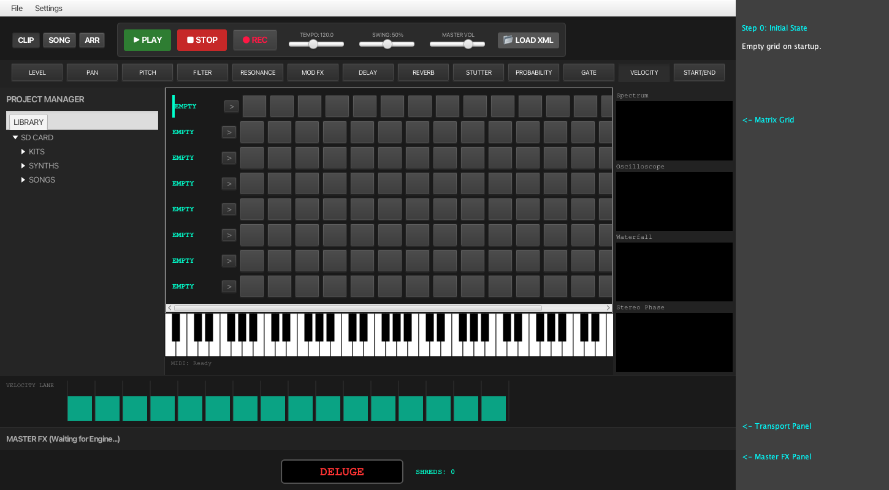
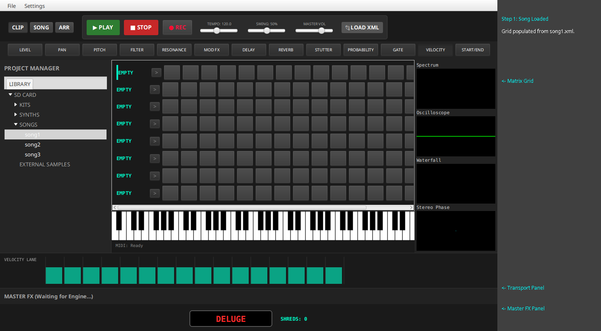
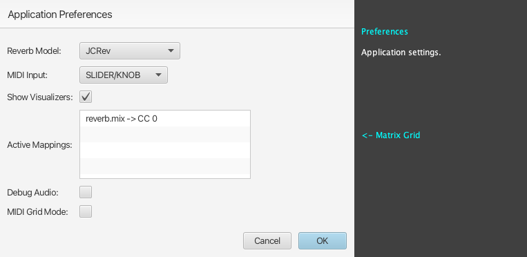

# ChucK-Java Deluge Guidebook

This book is a formal reference to the ChucK-Java Deluge Workstation, built to mirror the operation of the official Synthstrom Deluge manual as closely as possible in a software environment.

---

## 1. SONG CREATION & LOADING

▌ LOADING AN EXISTING SONG FROM LIBRARY
1. Open the **Project Manager** sidebar on the left.
2. Select the **LIBRARY** tab (this acts as the "SD CARD" explorer).
3. Expand the **SONGS** folder.
4. **Double-click** on a song file (e.g., `song1.xml`) to load it.
5. The status bar will indicate when the song is loaded, and the audio engine will load the associated samples.

▌ CREATING A NEW CLIP FROM SONG VIEW
*Note: In our software emulation, rows represent tracks/instruments, and columns represent clip slots.*
1. Switch to **SONG** view using the mode toggle buttons at the top.
2. Click an empty cell in a row labeled `EMPTY`.
3. *Current State*: This feature currently cycles through mock states (`PAT_0`, etc.) and does not yet create a fully functional clip in the project model. This is a known gap.

---

## 2. SONG MODE OPERATIONS

▌ LAUNCHING CLIPS
1. Switch to **SONG** view.
2. Each row corresponds to a track, and columns are clip slots.
3. On the **right side** of the grid, locate the control buttons for each row:
   - **L** (Launch): Click this button to start playback of the clip. It turns **green** when playing.
   - **C** (Color): Click this button to cycle through pad colors for that row.
4. The pads in the grid are solid colored when filled, matching the hardware pad style.

▌ SELECTING A CLIP TO EDIT
1. Switch to **SONG** view.
2. **Double-click on the row header** (the label on the left showing the clip name) to open it in the Clip Editor.
3. The view will automatically switch to **CLIP** mode, and the Matrix grid will be populated with the sequence from that clip.

---

## 3. RECORDING & MIDI SUPPORT

▌ LIVE GRID RECORDING
1. Click the **● REC** button in the Transport panel to enable Record mode.
2. Press **▶ PLAY** to start the playhead.
3. Click cells on the grid. They will act as trigger pads, recording notes at the current playhead position (`currentStep`) rather than toggling the step where you clicked.
4. Recorded notes will appear on the grid and play back in the next loop. Note duration is calculated precisely based on Note-Off events.

▌ MIDI INPUT & LEARN
1. Open **Settings > Mappings...** to select your MIDI Input device from the dropdown.
2. To bind a physical controller to a parameter:
   - Right-click any slider in the **MASTER FX** panel (e.g., Reverb Mix or Size).
   - Select **MIDI Learn** from the context menu.
   - Move a physical knob or fader on your MIDI controller.
3. The CC number is captured and bound to that parameter. Mappings are saved persistently across sessions.

▌ CLEARING A MAPPING (UNLEARN)
1. Right-click the slider you want to unbind in the **MASTER FX** panel.
2. Select **Clear MIDI Mapping** from the context menu.
3. The parameter will stop responding to the MIDI controller, and the mapping is removed from preferences.

▌ DISPLAYING ACTIVE MAPPINGS
1. Go to **Settings > Mappings...** in the menu.
2. A list at the bottom of the dialog will show all active mappings in the format `parameter -> CC number`.

▌ EXAMPLE: SETTING UP A KORG NANOKONTROL2
1. Connect your Korg nanoKONTROL2 via USB.
2. Open **Settings > Mappings...** in the menu.
3. In the **MIDI Input** dropdown, look for **"Slider/Knob"** (or "nanoKONTROL2" if explicitly named). On some systems, generic names like "Slider/Knob" are used for class-compliant controllers.
4. Select it, click OK, and **restart the application**.
5. Right-click the **Reverb Mix** slider in the **MASTER FX** panel and select **MIDI Learn**.
6. Move a fader on the nanoKONTROL2. The on-screen slider will now follow your physical movements!

---

## 4. AUTO-SCROLLING

▌ FOLLOWING THE PLAYHEAD
- The grid automatically supports **auto-scrolling** to follow the playhead across pages.
- When the playhead moves past step 15, the view shifts to show steps 16-31, and so on.
- This ensures you always see the active step during long sequences or live recording.
---

## 5. VISUAL WALKTHROUGH (E2E SCENARIO)

This section provides a step-by-step visual guide to a common user scenario: loading a song, editing steps, and controlling playback.

### Step 0: Initial State
When the application starts, the grid is empty, and the transport is stopped.

### Step 1: Song Loaded
After loading `song1.xml` from the library, the grid is populated with the song's patterns.

### Step 2: Editing Cells
Clicking on cells or receiving MIDI Grid notes toggles the steps. Here, steps 0, 4, 8, and 12 are enabled on the first track.

### Step 3: Playing
Pressing the **▶ PLAY** button starts the playhead moving across the grid.

### Step 4: Recording
Pressing the **● REC** button enables live recording mode. Incoming notes will be captured at the current step.

### Preferences Dialog
The application preferences can be accessed via **Settings > Preferences...**.

