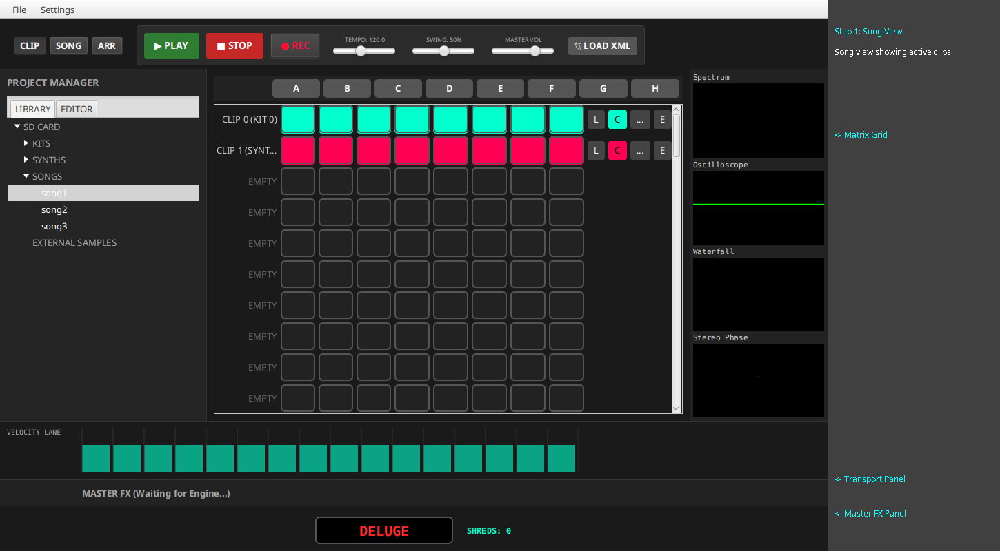
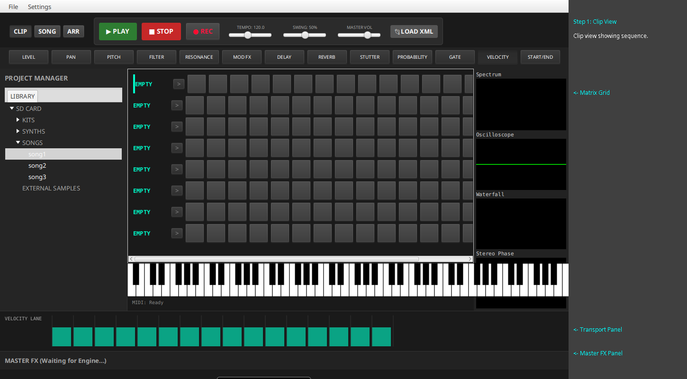
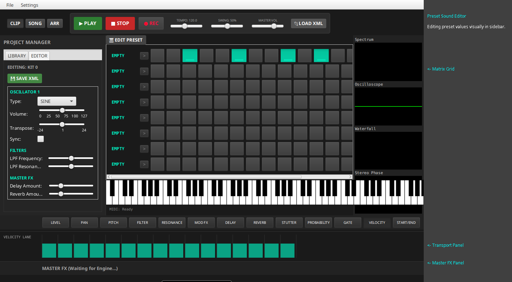
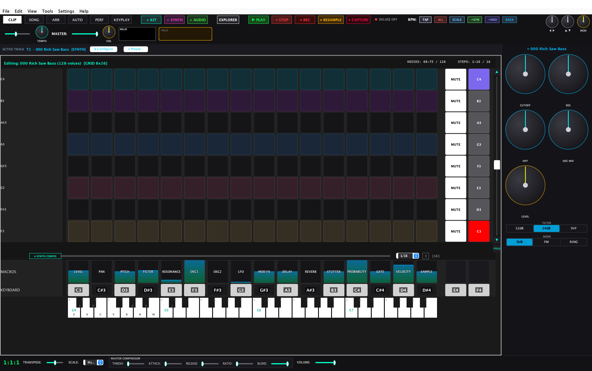
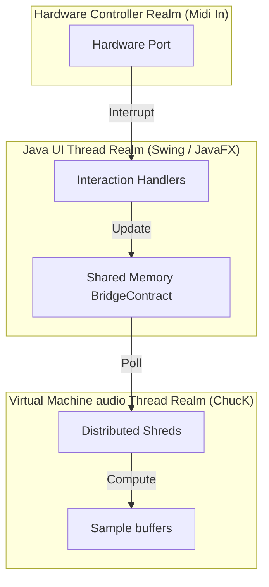

# ChucK-Java Deluge Guidebook

This book is a formal reference to the ChucK-Java Deluge Workstation, built to mirror the operation of the official Synthstrom Deluge manual as closely as possible in a software environment.

---

## 1. CORE CONCEPTS

### 1.1 View Modes
-   **Song Mode**: This view consolidates tracks and allows you to launch clips and manage the overall arrangement. Rows represent Clips (following the hardware model), and columns represent clip slots.
-   **Clip Mode**: This is where you edit the sequence for a single track. For a Kit track, rows represent different sounds (Kick, Snare, etc.). For a Synth track, rows represent pitches.
-   **Arranger Mode**: Used for linear arrangement of clips over time.

### 1.2 Instruments
-   **KIT**: A sample-based instrument. Loading a kit populates rows with different drum sounds.
-   **SYNTH**: A synthesis engine track for melodic lines.

### 1.3 Hardware Parity & Limits
-   Our implementation is inspired by the Synthstrom Deluge hardware.
-   We have expanded the Java DSL engine to support up to **64 simultaneous tracks** (e.g., 8 kits of 8 sounds each), allowing you to play multiple kits at once.
-   For a comprehensive per-feature and per-menu mapping against the official firmware, see [`FIRMWARE_FEATURES_MAPPING.md`](FIRMWARE_FEATURES_MAPPING.md).

### 1.4 Grid Mode (Viewport Configuration)

The grid viewport is configurable via **Settings → Preferences...** → **Grid Mode**. This controls how many rows and columns are visible at once, independent of the underlying clip data.

| Setting | Rows | Columns | Use Case |
|---------|------|---------|----------|
| GRID\_8x16  | 8  | 16 | Default. Matches real Deluge hardware (8×16 pads). |
| GRID\_16x16 | 16 | 16 | More voice rows for larger kits, same column width. |
| GRID\_24x16 | 24 | 16 | Maximum voice rows (24-step sequencer). |
| GRID\_16x24 | 16 | 24 | More visible steps per row (adds a horizontal scroll when clip length < 24). |

**How it works:**
- Changing the Grid Mode resizes the grid cells proportionally to fit the window — more cells = smaller pads, fewer cells = larger pads.
- The grid always draws `gridMode.rows` voice row slots in the viewport. If the model has more rows (e.g., a 16-sound TR-808 kit), **vertical scroll buttons (▲/▼)** appear in the CLIP view header.
- The MACROS, SLIDERS, and KEYBOARD rows stay fixed at the bottom regardless of grid mode.
- **SONG** and **ARRANGEMENT** views also respect the grid mode setting — the viewport shows `gridMode.rows` track slots immediately, no need to load a clip first.

**Per-clip step count:**
- Each clip has its own length (default 16, range 1–192). Right-click or double-click the `[N]` badge on the grid row to change it.
- When clip length exceeds `gridMode.columns`, a **horizontal scroll (◀/▶)** appears to pan the visible step window.
- `gridMode.columns` only affects the viewport, not the underlying clip data.

### 1.5 Auditioning
-   Before placing notes in the sequence, you can audition (preview) the sound of a given row.
-   In **Clip Mode**, click the rightmost pad/button of a row to hear the pitch or sound assigned to it.

### 1.6 Velocity View
-   Active step pads are rendered with **velocity-blended colors**: a step with full velocity (1.0) shows the full track color; lower velocities blend the color toward dark gray (`#333333`).
-   The cell text in CLIP mode now shows real values: `Ve:<val>` for velocity and `Pr:<val>` for probability, read directly from the engine.
-   To **set step velocity**, right-click a pad cell to open the **Step Properties** dialog, which includes a Velocity slider (0–100).
-   The **SLIDERS** row (row 9 in CLIP mode) provides per-column velocity faders — click and drag vertically on any column to adjust that step column's velocity across all rows.
-   The MIDI track click-path and playhead re-sync also respect the velocity blend, so pad brightness always reflects the current velocity value during playback.

### 1.7 Row-Level Velocity & Probability
-   **Right-click a row label** (the track name on the left of each row) to open the track context menu.
-   **Set Row Probability...**: Opens a dialog (0–100%) that applies the same probability value to all steps in that row. This is useful for introducing controlled randomness across an entire drum sound or voice — each step has an independent `probability%` chance of firing when the playhead passes over it.
-   **Set Row Velocity...**: Opens a dialog (0–100%) that applies the same velocity to all steps in that row. Useful for adjusting the overall dynamics of a sound without editing each step individually.
-   These operations target the currently edited clip's sequence data and respect the per-step column count (clip length).

### 1.8 Horizontal Grid Scrolling
-   When a clip is **longer than the current viewport** (e.g., a 32-step clip in 16-column grid mode), ◀ and ▶ buttons appear in the CLIP header row.
-   Click ◀ to scroll the visible step window left; click ▶ to scroll right.
-   The step range label (e.g., "1–16 / 32") shows which steps are currently visible and the total clip length.
-   The playhead and background step data sync correctly across all rows when the view is scrolled — steps outside the visible window don't show playhead indicators.
-   This works for both Kit and Synth tracks in CLIP mode.

---

## 2. SONG CREATION & LOADING

▌ LOADING AN EXISTING SONG FROM LIBRARY
1. Open the **Project Manager** sidebar on the left.
2. Select the **LIBRARY** tab (this acts as the "SD CARD" explorer).
3. Expand the **SONGS** folder.
4. **Double-click** on a song file (e.g., `song1.xml`) to load it.
5. The status bar will indicate when the song is loaded, and the audio engine will load the associated samples.

▌ PROJECT EXPLORER VS. LIBRARY
-   **PROJECT Tab**: Shows the active tracks and clips in the current project.
-   **LIBRARY Tab**: This is the functional file browser where you can load Kits, Synths, and Songs from resources or external folders.

▌ CREATING A NEW CLIP FROM SONG VIEW
*Note: In our software emulation, rows represent tracks/instruments, and columns represent clip slots.*
1. Switch to **SONG** view using the mode toggle buttons at the top.
2. Click an empty cell in a row labeled `EMPTY`.
3. *Current State*: This feature currently cycles through mock states (`PAT_0`, etc.) and does not yet create a fully functional clip in the project model. This is a known gap.

---

## 3. SONG MODE OPERATIONS

▌ LAUNCHING CLIPS
1. Switch to **SONG** view.
2. Each row corresponds to a track, and columns are clip slots.
3. On the **Right edge** of the grid (Columns 17 and 18), locate the dedicated hardware-style operation pads:
   - **Col 17 (MUTE)**: Toggles channel mute state. Turns Red when Muted. 
     - *Modifier*: `Shift + Click` fully erases the notes programmed in the sequencer track.
   - **Col 18 (EDIT / SOLO)**:
     - *In Clip View*: Acts as a Solo track toggle (Turns Green).
     - *In Song View*: Triggers manual Audition Previews, or focus-switches to the sound EDITOR.

▌ SELECTING A CLIP TO EDIT
1. Switch to **SONG** view.
2. **Click on the row header** (the label on the left showing the clip name) to open it in the Clip Editor.
3. The view will automatically switch to **CLIP** mode, and the Matrix grid will be populated with the sequence from that clip.

▌ MULTI-TAB TRACK INSPECTOR (DESKTOP EXCLUSIVE)
1. **Right-Click** any active pad square inside the arrangement timeline grid.
2. Opens a modular operations inspector deck containing:
   - **PRESETS Tab**: Hot-swapping active instrument sounds references immediately.
   - **CLIPBOARD Tab**: Triggering rapid variations duplicate chains (`Clone Clip`).
   - **MIXER Tab**: Master headroom amplification decks routing attenuation sliders.


▌ OPENING THE SOUND EDITOR
1. In **SONG** view, locate the **E** button on the right side of the track row.
2. Click it to focus and populate the dynamic **EDITOR** tab on the left sidebar, letting you tweak its parameters.

---

▌ MUTING A TRACK
1. In Song View, locate the **[M]** button on the right side of the track row (next to Launch and Color).
2. Click it to mute the track. The button turns yellow.
3. Click it again to unmute.
▌ LOOP-BOUNDARY MUTE (QUEUED MUTES)
1. In Song View, hold the `Shift` key and click the **[M]** mute button on the right side of the track row.
2. The Mute pad will flash, indicating that the mute operation is ARMED and queued.
3. As the playback playhead crosses loop step 0 (the end of the current sequence cycle), the track will fully and instantaneously mute.

▌ INDIVIDUAL ROW MUTE IN KITS
1. When working with a **Kit** clip (where each row is a different sound, like Kick, Snare, etc.), you can mute individual sounds.
2. Click the **M** button on the right side of the row to mute just that sound. It will turn yellow.
3. Click it again to unmute.

▌ SIDECHAIN COMPRESSOR DUCKING
- Active sequencing on **Row 1 (The Kick Drum instrument)** drives a global compressor envelope ducking all collateral channels headroom temporarily (120 milliseconds recovery), establishing timeline pulse pumping aesthetics.
- **Gain Reduction (GR) Meter (Desktop Exclusive)**: A responsive orange bar renders on the visualizer pane viewport edges illustrating live ducking headroom compression.


▌ VERTICAL PAD SHIFTING (RE-ORDERING CLIPS)
1. In **SONG** view, reorganize the vertical stacking of clips by holding the `SHIFT` key and clicking any active Pad.
2. This accelerator shifts the clip block focus up/down displacement targets to group sections structurally.

---


## 4. RECORDING & MIDI SUPPORT

▌ LIVE GRID RECORDING
1. Click the **● REC** button in the Transport panel to enable Record mode.
2. Press **▶ PLAY** to start the playhead.
3. Click cells on the grid. They will act as trigger pads, recording notes at the current playhead position (`currentStep`) rather than toggling the step where you clicked.
4. Recorded notes will appear on the grid and play back in the next loop. Note duration is calculated precisely based on Note-Off events.

▌ MIDI OUTBOUND SEQUENCING
- Sequencer pad notes emit outbound triggers on the first operational hardware port connected via native `RtMidiOut` pipeline integration.
- **Dedicated MIDI Track (Track Type 2)**: Mutes internal software synthesis acoustics to map operations strictly delivering output sequence integers over continuous physical chords pipelines.
- **Outbound Activity LEDs**: Pads flash momentarily yellow providing execution stream indicators on MIDI deliveries.


▌ CLIP STUTTER ROLL ACCELERATOR
- Hold down any active sequence Pad on a drum kit track to repetitively re-trigger sound bursts at division rate intervals (1/8th note rolls).
- Release the pad stops the repeating triggers.

▌ ONE-SHOT (ONCE) TIMELINE CLIPS
- Toggles a track to automatically silence itself after playing exactly one sequence pass loop. 
- `SHIFT + Click` the left row header label text to engage the mode (appends `(1SH)` indicator tag).


▌ MIDI INPUT & LEARN
1. Open **Settings > Preferences...** to select your MIDI Input device from the dropdown.
2. To bind a physical controller to a parameter:
   - Right-click any slider in the **MASTER FX** panel (e.g., Reverb Mix or Size).
   - Select **MIDI Learn** from the context menu.
   - Move a physical knob or fader on your MIDI controller.
3. The CC number is captured and bound to that parameter. Mappings are saved persistently across sessions.

▌ CLEARING A MAPPING (UNLEARN)
1. Right-click the slider you want to unbind in the **MASTER FX** panel.
2. Select **Clear MIDI Mapping** from the context menu.
3. The parameter will stop responding to the MIDI controller, and the mapping is removed from preferences.

▌ DISPLAYING ACTIVE MAPPINGS
1. Go to **Settings > Preferences...** in the menu.
2. A list at the bottom of the dialog will show all active mappings in the format `parameter -> CC number`.

▌ MIDI GRID CONTROLLER MODE
1. Go to **Settings > Preferences...** and check **"MIDI Grid Mode"**.
2. In this mode, incoming MIDI notes are mapped to grid coordinates (Row = note / 16, Column = note % 16).
3. Pressing a pad on your controller will toggle the step on the grid instead of playing a note!

▌ EXAMPLE: SETTING UP A KORG NANOKONTROL2
1. Connect your Korg nanoKONTROL2 via USB.
2. Open **Settings > Preferences...** in the menu.
3. In the **MIDI Input** dropdown, look for **"Slider/Knob"** (or "nanoKONTROL2" if explicitly named). On some systems, generic names like "Slider/Knob" are used for class-compliant controllers.
4. Select it, click OK, and **restart the application**.
5. Right-click the **Reverb Mix** slider in the **MASTER FX** panel and select **MIDI Learn**.
6. Move a fader on the nanoKONTROL2. The on-screen slider will now follow your physical movements!

---

## 5. AUTO-SCROLLING

▌ FOLLOWING THE PLAYHEAD
- The grid automatically supports **auto-scrolling** to follow the playhead across pages.
- When the playhead moves past step 15, the view shifts to show steps 16-31, and so on.
- This ensures you always see the active step during long sequences or live recording.

---

## 6. VISUAL WALKTHROUGH (E2E SCENARIO)

This section provides a step-by-step visual guide to a common user scenario: loading a song, editing steps, and controlling playback.

### Step 0: Initial State
When the application starts, the grid is empty, and the transport is stopped.


### Step 1: Song View
After double-clicking `song1.xml` in the Library explorer, the Song View opens, showing active clips as colored pads.


### Step 2: Clip View
Double-clicking a clip in Song View opens it in the Clip Editor, showing the note sequence on the grid.


### Step 3: Editing Cells
Clicking on cells or receiving MIDI Grid notes toggles the steps. Here, steps 0, 4, 8, and 12 are enabled on the first track.


### Step 4: Playing
Pressing the **▶ PLAY** button starts the playhead moving across the grid.


### Step 5: Recording
Pressing the **● REC** button enables live recording mode. Incoming notes will be captured at the current step.


### Preferences Dialog
The application preferences can be accessed via **Settings > Preferences...**.


### Preset Sound Editor
Clicking the **E** button in Song View or the **🎹 EDIT PRESET** button at the bottom of the Clip View opens the Sound Editor.



---

## 7. QUICK REFERENCE (SOFTWARE EQUIVALENTS)

Here is a map of common hardware actions to their software equivalents in our emulation:

| Hardware Action | Software UI Equivalent |
| :--- | :--- |
| **Audition Pad** (Far Right) | Click the Audition button `>` on the left of the row. |
| **Toggle Step** | Click any cell in the 16x8 grid (Clip Mode). |
| **Launch Clip** | Click Pad 18 on the right edge of the grid (Song Mode). |
| **Mute Track** | Click Pad 17 on the right edge of the grid. (`Shift + Click` clears notes). |
| **Change Color** | Right-Click the Track Row label text (Far Left). |
| **QWERTY Piano Play** | Press keyboard rows `Z-M` (White keys) and `S-J` (Black keys). |

---

## 8. SOUND EDITORS & CONTROLS WORKFLOW (MANUAL)

This section highlights all Sound and parameters editors workspace validation checks dynamically and each of their individual fields. 

### 8.1 Sidebar Sound Preset Editor 
Exposes synthesis preset sound parameters categorized inside visually premium dynamic folding Accordion categorisation groupings workspace: 
#### Category: OSCILLATORS
Contains inner sub accordions categorization grouping setups: 
- **OSCILLATOR 1 & 2**:
  - **Type**: Wave generator live inputs choices (SINE, SAW, SQUARE, TRIANGLE, SAMPLE, DX7 FM SYNTH). 
 
  - **Volume**: Individual oscillator amplitude level values. 
  - **Transpose**: Individual transposition values.
  - **Sync Checkbox**: Syncs with live frequency retrigger phase assignments bounds rules checks. 
  - **Pulse Width**: live dynamic pulse duty width slider. 
  - **Retrig phase**: note trigger phase degrees (0 to 360). 
- **MODULATOR 1 & 2 (FM Synthesis)**: 
  - **Transpose**: FM transposition values. 
  - **Amount**: visual modular amounts depth level. 
  - **Feedback**: Amplitude modulator live feedback assignments depth levels. 
  - **Destination (on MOD 2 only)**: destination combos logic dropdown (CARS, MOD1). 

#### Category: FILTERS 
- **LPF Frequency**: Low-pass cutoff frequency dynamic values. 
- **LPF Resonance**: filter frequency visual resonance cutoff depth. 

#### Category: MASTER FX 
- **Delay Amount**: visual Delay depth amount depth. 
- **Reverb Amount**: visual live Reverb depth values. 

> [!NOTE]
> Both Oscillator 1 volume and Low pass filter Cutoff parameters are modulated with dynamic live interactive patching logic visual matrix popups depth values assignments bounds. Click the Little dynamic **`M`** button next to parameter inputs values sliders to open live depth modulation matrices depth assignments popups. Modulations sources: LFO1, LFO2, ENV1, ENV2, RANDOM probabilities odds paths, dynamic velocities, step sidechains compressor levels assignments. 

---

### 8.2 Step effects Parameter visual visualizer lane Workspace 
Sitting dynamic line-by-line alignment underneath the sequence Matrix Grid workspace. Tapping visual path over step effects visualizer bars canvas workspace enables live visual dynamic automation drawing paths. Parameters steps and cutoff values supported: 
- VELOCITY, GATE note duration timing percentage 
- PITCH transposition, PROBABILITY odds
- FILTER sweeps cutoff paths automation, RESONANCE 
- PAN sweeps, master delay and master reverb amount depth paths live logic validation bounds checks 

---

### 8.3 Global Visual parameters Workspace lane
Sitting underneath the sequence visual dynamic Step effects visualizer lane visual workspace. Exposes track global visual sliders: 
- **TRACK LEVEL**: Controls active global track level volume. 
- **TRANSPOSE**: track global scale note transpose level values. 

---

### 8.4 live visual Euclidean visual visualizer arpeggiation popup
Press active Grid Workspace **`P`** validation onboard key. dynamic Visual step Euclidean rhythm live step sequencer distributions dynamically: 
- **Hits ($K$)**: Active sequencing notes active. 
- **Steps ($N$)**: Sequence duration validation checks duration. 
- **Offset ($O$)**: Step sequence horizontal timeline shift offset. 

---

## 9. PLANNED FEATURES / FUTURE VISION

*Note: The following features are described in the original design documents but are **not yet implemented** in the current software version. They represent the roadmap for future development.*

### 8.1 Advanced Object Model
-   **Clips**: Duplicate via `Alt + Drag`.
-   **Synth/Kit**: Edit via a full Node-based Graph Editor.

### 8.2 Advanced Interface Concepts
-   **Marquee Selection**: Click and drag a box over notes or clips to select multiple objects.
-   **Shift + Drag**: Disable "Snap to Grid" for fine-grained, humanized timing.
-   **Drag-and-Drop**: Drag Synth/Kit XMLs directly from the library onto clips to load presets.

### 8.3 Visual Editors
-   **OSC & FM Matrix**: A node-based editor for connecting operators via drag-and-drop.
-   **Multisampling Editor**: A waveform view where users drag `.wav` files onto a virtual piano keyboard for automatic pitch mapping.
-   **Automation Graphs**: Draw Bezier curves over the grid for parameter modulation.

### 8.4 Planned Shortcuts
-   `Ctrl + Mouse Wheel`: Zoom (Horizontal).
-   `Shift + Mouse Wheel`: Zoom (Vertical).
-   `Middle-click + Drag`: Scroll (Hand Tool).
-   `P` key: Open visual arpeggiator pattern editor with Euclidean toggle.
---

## 10. SWING UI EDITION REFERENCE

A lightweight, pure Java desktop UI alternative built entirely on Swing (accessible by launching with the `--swing` argument). Ideal for environments with native layout render bottlenecks.

▌ INTERFACE TOPOGRAPHY
- **Grid Layout partitions (GridBagLayout)**:
    - **Top strip**: Houses full modular views switches buttons (CLIP, SONG, ARR), global sequence controls (Play, Stop, Rec, Load XML), and speed modulators (BPM, Swing, Master volume sliders).
    - **Center Viewports canvas**: Confined behind centered scrollbars containment viewports locking cell pads proportions securely.
    - **Southern strip arrays**: Spans stacked parameter modifier ribbons layer toggling graphical draws step plots.

▌ VISUAL WALKTHROUGH (SWING)
- **Step 0: Pure Swing Workspace Launch**
  

- **Step 1: Song View (Loaded project)**
  

- **Step 1b: Clip View (Sequencer Editor pads)**
  

---

## 11. FORMAL UI DESIGN SPECIFICATION

### 11.1 Architectural Layout (Framework-Independent)
The UI follows a classic Digital Audio Workstation (DAW) topography, divided into five primary regions using a border-layout or grid-bag approach:
1. **Top Panel**: Transport & Global Controls
2. **Left Panel**: Navigation & Preset Editing (Sidebar)
3. **Center Panel**: The Matrix Grid (Primary Workspace)
4. **Right Panel**: Real-time Audio Visualizers
5. **Bottom Panel**: Step Modifiers & Global Track Controls

### 11.2 Component Breakdown

#### Top Panel (Header Strip)
*   **Mode Toggles**: A distinct button group to switch the Center Workspace context (`CLIP`, `SONG`, `ARR`).
*   **Transport Controls**:
    *   `PLAY` (Green accent, playback toggle)
    *   `STOP` (Red accent, playback stop/reset)
    *   `REC` (Dark with red indicator, arm recording)
*   **Global Parameters**:
    *   `TEMPO` / `BPM` (Slider with numeric readout, e.g., 120.0)
    *   `SWING %` (Slider, 0-100%)
    *   `MASTER VOL` (Slider)
*   **Action Buttons**: `LOAD XML` for loading legacy or external project files.

#### Left Panel (Sidebar)
*   **Tabbed Interface**:
    *   **LIBRARY Tab**: A tree/hierarchical view displaying the file system (SD CARD) with folders for `KITS`, `SYNTHS`, `SONGS`, and `EXTERNAL SAMPLES`. Double-clicking a file loads it into the global model.
    *   **EDITOR Tab**: A dynamic property inspector. When a track is selected, it displays nested accordion menus:
        - **OSCILLATORS**: Type select (Sine, Saw, Square, Triangle, Noise), Volume, Transposition, and Pulse Width.
        - **MODULATORS**: Modulator matrix depth (FM synthesis amounts).
        - **FILTERS**: Low-pass and High-pass Cutoff sweeps, filter types select.
        - **ENVELOPES**: Complete Attack, Decay, Release, and Sustain ADSR curve limits.
        - **DISTORTIONS**: Bit-depth decimation limits and drive limits.
        - **MASTER FX**: Global visual reverb room sizes and delays send loops.

    *   **MIDI Tab**: (Primarily in Swing) For mapping and routing overviews.

#### Center Panel (The Matrix)
*   **The Grid**: A responsive 2D matrix (default 8 rows x 16 columns) representing step pads.
    *   **Row Headers (Left side of grid)**: Labels for the row (e.g., "EMPTY", "PAD 1", or Note Names). Includes a quick Audition `>` button to preview the row's sound.
    *   **Track Controls (Right side of grid)**: Dedicated pads at Column 17 (MUTE - toggles track activity) and Column 18 (EDIT / SOLO).


*   **Bottom Anchor (Clip Mode)**:
    *   **Piano Roll**: A clickable piano keyboard graphic spanning the width of the grid, enabling melodic input. Includes a horizontal scrollbar above it to page through time (auto-scrolling tracks the playhead).
*   **Parameter Ribbon**: A horizontal strip of toggle buttons immediately below the grid used to select the active Step Effects lane (e.g., `LEVEL`, `PAN`, `PITCH`, `FILTER`, `RESONANCE`, `MOD FX`, `DELAY`, `REVERB`, `PROBABILITY`, `GATE`, `VELOCITY`, `START/END`).

#### Right Panel (Visualizer Stack)
A vertically stacked column of four real-time graphical scopes mapping to the master audio bus:
1.  **Spectrum** (FFT Analysis)
2.  **Oscilloscope** (Waveform Time-Domain)
3.  **Waterfall** (3D Spectrogram)
4.  **Stereo Phase** (Goniometer / Lissajous curve)

#### Bottom Panel (Step Effects & Status)
*   **Step Effects Visualizer Lane**: A 16-step horizontal bar chart corresponding to the grid's columns. When a parameter (like Velocity or Pitch) is selected in the Ribbon above, this lane allows the user to draw dynamic per-step automation.
*   **Track Global Controls**:
    *   `TRACK LEVEL` slider.
    *   `TRANSPOSE` slider (ranged -24 to +24).
    *   `GLOBAL TEMPO` slider (mirrors top panel or acts as override).
    *   `SCALE` dropdown (e.g., "Major", "Minor").
*   **Status Bar (Footer)**:
    *   System messaging ("Waiting for Engine...", "MIDI: Ready").
    *   Application Branding module ("DELUGE").
    *   Performance metrics ("SHREDS: 0", indicating active concurrent Chuck threads).

### 11.3 Core Interaction Paradigms
*   **Contextual Drill-Down**: Double-clicking a track/clip row in Song Mode immediately shifts the view to Clip Mode, populating the matrix with that clip's specific step data.
*   **Grid Toggling & Recording**: Single clicks on grid cells toggle step activation. When Record (`REC`) is active, clicking cells acts as live trigger pads. In "MIDI Grid mode", incoming physical MIDI notes map directly to grid coordinates.
*   **Continuous Automation Drawing**: Clicking and dragging across the Step Effects Visualizer Lane (Bottom Panel) draws a curve for the selected parameter.
*   **MIDI Learn Context Menus**: Right-clicking virtually any slider (e.g., Reverb Mix) triggers a context menu to map or clear a physical MIDI CC assignment.

### 11.5 Logical Model Connections (The Bridge Contract)

The User Interface interacts with the sample-accurate synthesis engine entirely via shared static memory arrays managed by `org.chuck.deluge.BridgeContract`. There is no network overhead; UI changes map instantly to ChucK virtual machine shreds.

#### Global Scalars (Live bindings)
- `g_bpm` (Float): Master tempo. Mapped to slider drag events on the top transport ribbon.
- `g_swing` (Float): Shuffle ratio (0.5 = straight, 0.75 = heavy swing).
- `g_play` (Integer): Playback trigger bit. (`0` = stop, `1` = play).
- `g_current_step` (Integer): Read-only sequence step cursor. Drives playhead highlights framing rendering cycles.
- `g_master_vol` (Float): Output master audio gain attenuation.

#### Distributed Shared Arrays (Midi/Automation state mapping)
- `g_pattern` [Size: 128] (Integer): 1/0 bitmask storing note activity. Index computed via `trackIdx * 16 + stepIdx`.
- `g_velocity` [Size: 128] (Float): Per-step velocity automation values.
- `g_filter` [Size: 16] (Float pairs): Consecutive track frequency cutoff and resonance values tuples. 

### 11.6 Application State & Preferences Registry

Persistent preferences are handled through `org.chuck.deluge.project.PreferencesManager` and configure hardware boundaries on application boot cycles:
- `midi.input` (String): Descriptors name of incoming physical interface hardware port.
- `reverb.model` (String): Algorithmic architecture selection switch (`JCRev`, `FreeVerb`, `ProceduralReverb`).
- `show.visualizers` (Boolean): GPU acceleration optimization toggles gating FFT analyzer pipeline loops.
- `preset.linking.policy` (String): Governs composition save files structure (`EMBED` vs `LINK_LIVE` references).

> [!WARNING]
> **Hardware Parity Compatibility Constraint**:
> - `EMBED` is the default factory configuration. It guarantees full backward compatibility with official Synthstrom Deluge physical hardware.
> - Switching to `LINK_LIVE` means Songs will store file references instead of duplicate definitions. 
> - **Side Effects**: Exporting `.xml` Songs built with `LINK_LIVE` policy onto an SD Card to be loaded on real Deluge hardware will fail to recognize sound generators, as the native unit expects embedded parameters explicitly.


---


## 13. PERSISTENCE & STATE STORAGE SPECIFICATION

### 13.1 Directory structure resolution
The application reads and writes configurations matching standard local hierarchy mappings:
```text
[App Root Path or preferences directory mapping]
├── SONGS/          # Holds Master Project configuration state triggers .xml 
├── KITS/           # Holds instrument percussion elements allocations .xml
├── SYNTHS/         # Holds instrument synthesis node parameters .xml
└── SAMPLES/        # Binary PCM .wav / .aif acoustic streams assets
```

### 13.2 Saving streams execution
- **Songs backup triggers**: Bound across Master navigation ribbon setups providing manual serializations loops.
- **Active presets exports**: Triggered atop editing dials drawer pipelines backing updates to disk pointers.

---

## 14. ADVANCED ENGINEERING SCHEMATICS

### 14.1 Concurrent Thread Boundaries
To maintain zero-latency graphics response alongside sample-accurate synthesis timings, the application spans three isolated thread realms governed through lock-free boundaries:



### 14.2 Deployment Pad layouts geometry
- **Pad Aspect bounding boxes ratios**: Preserved at `1:1` squares mapping matrix grids spans symmetrically. 

---

## 15. CHUCK LIVE NODE INSTRUMENTS (THE [C] CLIP)

Bypassing fixed subtractive synthesis XML models, the workstation enables hosting raw algorithmic synthesis scripts directly sequenced inside arrangement grids timelines.

### 15.1 Serialization schema
Song projects store file paths pointers resolving execution dependencies at load times:
```xml
<instrument type="CHUCK">
  <scriptPath>/CHUCKS/custom_fm.ck</scriptPath>
</instrument>

### 15.2 Debug Execution Log Consoles
Workstation sidebar editors expose script execution stdout readouts catching compilation syntax errors diagnostic feedback securely.

```
 


