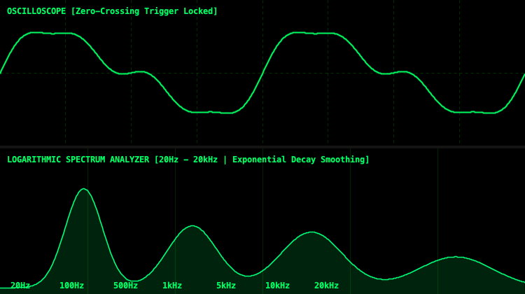
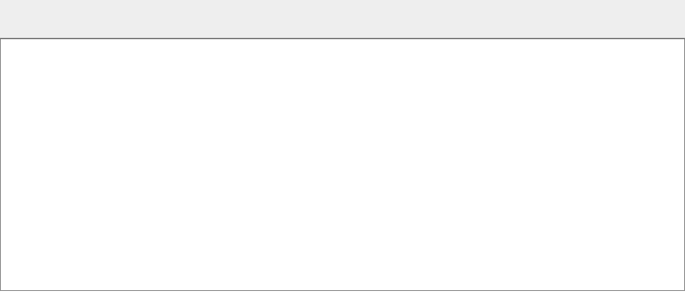

# ChucK-Java Workstation End-User Guidebook

Welcome to the **ChucK-Java IDE Workstation** — a modern, interactive, and fully-featured audio programming environment for the ChucK strongly-timed music language running on **pure Java and Project Loom virtual threads (JDK 27-ea)**.

This guidebook covers every UI screen, toolbar action, visualizer graph, menu option, and interactive dialog in the ChucK-Java desktop application.

---

## 1. Workstation Overview & Layout

The main workstation window is designed for real-time live coding, multi-shred concurrency monitoring, and instant visual feedback of your audio synthesis graphs.


### The Primary Workspace Regions:
1. **Menu Bar (Top):** Access file operations, editing utilities, audio settings, interactive tutorials, and over 600+ categorized ChucK example scripts.
2. **Action ToolBar:** High-visibility quick controls for sporking and managing virtual machine shreds (`Add Shred`, `Replace Shred`, `Clear VM`, `● Record WAV`).
3. **Multi-Tab Code Editor (Center Left):** Syntax-highlighted ChucK and Java DSL source code editor with line numbering, multi-tab splitting, and instant on-the-fly execution.
4. **Active Shreds Dashboard (Center Right):** Real-time monitoring of all sporked shreds (`ChuckShred`) running concurrently inside the VM, displaying live elapsed durations.
5. **Detachable Virtual Console (Bottom Center):** Timestamped log stream for `<<< ... >>>` prints, compiler messages, and system events with real-time regex filtering.
6. **Real-time Audio Visualizers (Bottom Right):** CRT-style oscilloscope and logarithmic FFT spectrum analyzer monitoring the master DAC stereo bus.
7. **Transport & Status Footer (Bottom):** Live transport bar displaying current file name, running VM time, active shred count, sample rate (`44100Hz`), CPU load (`~2.1%`), and live recording indicator (`● RECORDING`).

---

## 2. Action ToolBar & Core Controls

The primary action toolbar sits directly below the menu bar and provides one-click control over the `ChuckVM`:

```
[ Add Shred ]  [ Replace Shred ]  |  [ Clear VM ]  |  [ ● Record WAV ]
```

- **Add Shred (`Ctrl+Enter` or `Cmd+Enter`):** Compiles the currently active code tab (either `.ck` ChucK script or `.java` DSL) and sporks a new independent `ChuckShred` on a Project Loom virtual thread inside the running VM. The new shred immediately begins synthesizing audio alongside existing shreds.
- **Replace Shred (`Ctrl+Shift+Enter` or `Cmd+Shift+Enter`):** Atomically removes the oldest active shred spawned from the current tab and replaces it with the newly compiled code. Essential for live-coding performances and iterating on synth patterns without stacking duplicate voices.
- **Clear VM (`Ctrl+Shift+C`):** Immediately terminates all active shreds, clears event broadcast queues, and silences the master DAC bus.
- **● Record WAV (`Ctrl+R`):** Toggles real-time master DAC audio recording to disk (see **Section 6: Live Audio Recording**).

---

## 3. Professional Audio Visualizer Suite

The ChucK-Java visualizer engine (`VisualizerPanel.java`) has been engineered to match and exceed the visual clarity of native `miniAudicle`, providing rock-steady CRT waveform monitoring and high-definition spectral analysis.



### 3.1. Zero-Crossing Trigger Locked Oscilloscope
Unlike raw linear buffer plotters that jitter and scroll unpredictably across the screen, the ChucK-Java oscilloscope implements **positive-slope zero-crossing trigger locking**:
- **Trigger Search (`data[i] <= 0 && data[i+1] > 0`):** The renderer scans the real-time audio buffer for the exact moment the waveform crosses the $0\text{V}$ baseline moving upward. By locking the drawing origin to this trigger point, periodic waveforms (sine, sawtooth, pulse, FM synths) stand frozen on screen with sharp, professional precision.
- **CRT Phosphor Glow:** Employs multi-pass alpha-blended stroke rendering (`Color.rgb(0, 255, 100, 0.25)`) over a dashed green center baseline to recreate classic hardware oscilloscope aesthetics.

### 3.2. Logarithmic FFT Spectrum Analyzer
Analyzes the frequency content of the master stereo bus across the full human auditory range:
- **Logarithmic Frequency X-Axis ($20\text{ Hz}$ to $20\text{ kHz}$):** Replaces linear FFT bin distribution with a logarithmic frequency mapping ($20 \times 1000^x$), ensuring that sub-bass, mid-range formants, and high-frequency sizzle receive accurate, proportional screen real estate (`20Hz`, `100Hz`, `500Hz`, `1kHz`, `5kHz`, `10kHz`, `20kHz`).
- **Exponential Decay Smoothing:** Applies temporal decay smoothing ($\text{bin} = 0.82 \times \text{prev} + 0.18 \times \text{curr}$) to prevent spectral flicker, accompanied by translucent green gradient underfill and calibrated `-60dB`, `-40dB`, and `-20dB` gridlines.

---

## 4. Detachable Virtual Console Panel

The **Virtual Console (`VirtualConsolePanel.java`)** captures all standard output (`chout`), error messages (`cherr`), and `<<< "..." >>>` print statements executed by your ChucK shreds.



### Virtual Console Features:
- **Real-Time Search & Keyword Filter Bar:** Type any keyword (`Shred [2]`, `error`, `124 BPM`, `freq`) in the top search field to instantly filter the log view in real time. Historical logs are preserved in memory so clearing the search bar immediately restores the full context.
- **Timestamp Formatting:** Automatically formats and prepends precise millisecond timestamps (`[HH:mm:ss.SSS]`) to VM notifications and log lines.
- **Auto-Scroll Checkbox:** Option to toggle bottom auto-scrolling during high-speed data bursts or freeze the view to inspect previous stack traces.
- **↗ Detach / ↙ Attach Pop-out Window:** Click **`↗ Detach Console`** to undock the console from the bottom footer and pop it out into a standalone, resizable floating window (`Virtual Console - ChucK-Java`). This matches `miniAudicle`'s multi-window workflow and is perfect for multi-monitor setups. When done, click **`↙ Attach Console`** or simply close the floating window to dock it seamlessly back into the main IDE window.

---

## 5. Live Shred Property Inspector

Double-clicking any active shred in the right-hand **Active Shreds list** (or right-clicking -> **"Inspect Shred Details..."**) opens the interactive **Shred Property Inspector Dialog (`ShredInspectorDialog.java`)**.


### Inspector Metadata Displayed:
- **Source Script Name & ID:** The unique numerical shred ID (`#id`) and the source `.ck` / `.java` file name.
- **Spork Timestamp & Elapsed Duration:** Exact creation time (`Thu Jul 16 10:14:22 2026`) and live-updating elapsed run time (`14.2s`).
- **VM Execution State:** Real-time state indicator reporting whether the shred is:
  - `Active / Running`: Executing instructions during the current sample tick.
  - `Yielded / Waiting on time or event`: Parked on a Project Loom virtual thread waiting for a `=> now` duration or `ChuckEvent.broadcast()`.
  - `Done / Terminated`: Reached the end of execution and queued for cleanup.
- **Code Instructions & Memory Stack Pointer:** Reports the total compiled instruction count (`getNumInstructions()`) and the active memory stack frame depth (`mem.getSp()`).
- **Direct Control Actions:** Click **`[Kill Shred X]`** inside the inspector to immediately remove and terminate the target shred from the `ChuckVM`.

---

## 6. Live Audio Recording & Master Transport

ChucK-Java includes a built-in, low-latency 16-bit/32-bit PCM audio recorder (`WvOut`) directly wired into the master DAC buffer loop (`ChuckAudio.java`).

### How to Record Your Performance:
1. Click **`● Record WAV`** on the main toolbar (or select **`Audio -> Record DAC to WAV...`** from the menu bar, `Ctrl+R`).
2. A file saver dialog prompts you to name and choose the destination for your `.wav` file (defaulting to `recording_<timestamp>.wav`).
3. Once confirmed, the button turns into a bold red **`■ Stop REC`** button, and the status bar footer displays a flashing **`● RECORDING`** badge alongside your live sample rate (`SR: 44100Hz`) and CPU load (`CPU: 2.1%`).
4. Perform your live-coding session, add/replace shreds, or tweak MIDI controllers.
5. Click **`■ Stop REC`** when finished. The WAV header is finalized, and your pristine audio recording is saved instantly to disk without audio glitches or dropouts.

---

## 7. Menu Bar & Example Library

The top menu bar organizes the complete functionality of the ChucK-Java environment:

- **File:**
  - `New (Ctrl+N)`: Create a fresh ChucK (`*.ck`) or Java DSL (`*.java`) editor tab.
  - `Open... (Ctrl+O)`: Load an existing script from disk.
  - `Save (Ctrl+S)`: Save the current tab.
  - `Save as Java DSL...`: Automatically translate the active ChucK (`*.ck`) script into pure, pre-compiled Java code (`*.java`) using `ChuckToDSLConverter`.
  - `Exit (Ctrl+Q)`: Cleanly shut down the audio backend, virtual threads, and IDE.
- **Edit:** Standard undo (`Ctrl+Z`), redo (`Ctrl+Y`), cut, copy, paste, and select-all actions powered by our bounded Command/Memento `UndoRedoStack` engine (`UndoRedoStack.java`).
- **View:** Zoom in (`Ctrl+=`), zoom out (`Ctrl+-`), and toggle the bottom interactive **Piano Keyboard** (`Show Keyboard`).
- **Audio:** Access **`Record DAC to WAV... (Ctrl+R)`**.
- **Tutorial:** Interactive, step-by-step ChucK programming walkthroughs covering basic pitch, arrays, time/concurrency, and STK synthesis.
- **Examples:** Direct menu access to over **600+ included ChucK scripts** categorized cleanly into:
  - `Core Language`: `basic`, `array`, `class`, `ctrl`, `event`, `func`, `io`, `machine`, `math`, `oper`, `shred`, `string`, `time`, `type`.
  - `Audio & Synthesis`: `stk`, `filter`, `effects`, `analysis`, `deep`, `stereo`, `multi`.
  - `External I/O & Specialized`: `midi`, `hid`, `osc`, `ai` (`word2vec`, `wekinator`).
- **Help:** Direct links to the official ChucK-Java GitHub repository and version about dialog (`ChucK-Java v1.5 Workstation on JDK 27-ea`).
