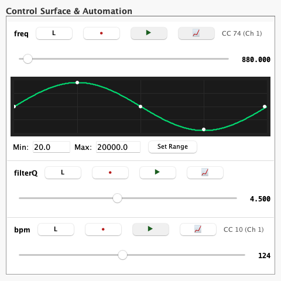
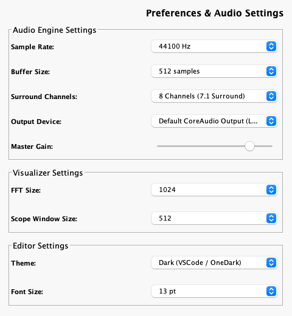
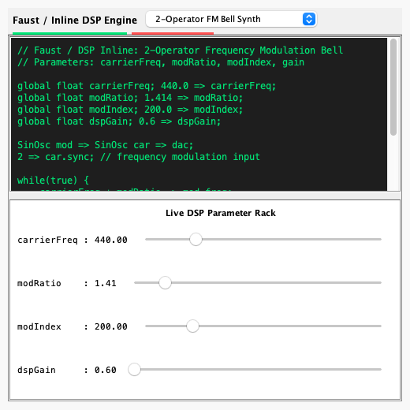

# ChucK-Java Workstation End-User Guidebook

Welcome to the **ChucK-Java IDE Workstation** — a modern, interactive, and fully-featured audio programming environment for the ChucK strongly-timed music language running on **pure Java and Project Loom virtual threads (JDK 27-ea)**.

This guidebook covers every UI screen, toolbar action, visualizer graph, menu option, and interactive dialog in the ChucK-Java desktop application.

---

## 1. Workstation Overview & Layout

The main workstation window is designed for real-time live coding, multi-shred concurrency monitoring, and instant visual feedback of your audio synthesis graphs.


### The Primary Workspace Regions:
1. **Menu Bar (Top):** Access file operations, editing utilities, audio settings, interactive tutorials, and over 600+ categorized ChucK example scripts.
2. **Action ToolBar:** High-visibility quick controls for sporking and managing virtual machine shreds (`Add Shred`, `Replace Shred`, `Clear VM`, `● Record WAV`).
3. **Multi-Tab Code Editor (Center Left):** Syntax-highlighted ChucK and Java DSL source code editor with line numbering, multi-tab splitting, and instant on-the-fly execution.
4. **Active Shreds Dashboard (Center Right):** Real-time monitoring of all sporked shreds (`ChuckShred`) running concurrently inside the VM, displaying live elapsed durations.
5. **Detachable Virtual Console (Bottom Center):** Timestamped log stream for `<<< ... >>>` prints, compiler messages, and system events with real-time regex filtering.
6. **Real-time Audio Visualizers (Bottom Right):** CRT-style oscilloscope and logarithmic FFT spectrum analyzer monitoring the master DAC stereo bus.
7. **Transport & Status Footer (Bottom):** Live transport bar displaying current file name, running VM time, active shred count, sample rate (`44100Hz`), CPU load (`~2.1%`), and live recording indicator (`● RECORDING`).

---

## 2. Action ToolBar & Core Controls

The primary action toolbar sits directly below the menu bar and provides one-click control over the `ChuckVM`:

```
[ Add Shred ]  [ Replace Shred ]  |  [ Clear VM ]  |  [ ● Record WAV ]
```

- **Add Shred (`Ctrl+Enter` or `Cmd+Enter`):** Compiles the currently active code tab (either `.ck` ChucK script or `.java` DSL) and sporks a new independent `ChuckShred` on a Project Loom virtual thread inside the running VM. The new shred immediately begins synthesizing audio alongside existing shreds.
- **Replace Shred (`Ctrl+Shift+Enter` or `Cmd+Shift+Enter`):** Atomically removes the oldest active shred spawned from the current tab and replaces it with the newly compiled code. Essential for live-coding performances and iterating on synth patterns without stacking duplicate voices.
- **Clear VM (`Ctrl+Shift+C`):** Immediately terminates all active shreds, clears event broadcast queues, and silences the master DAC bus.
- **● Record WAV (`Ctrl+R`):** Toggles real-time master DAC audio recording to disk (see **Section 6: Live Audio Recording**).

---

## 3. Professional Audio Visualizer Suite

The ChucK-Java visualizer engine (`VisualizerPanel.java`) has been engineered to match and exceed the visual clarity of native `miniAudicle`, providing rock-steady CRT waveform monitoring and high-definition spectral analysis.


### 3.1. Zero-Crossing Trigger Locked Oscilloscope
Unlike raw linear buffer plotters that jitter and scroll unpredictably across the screen, the ChucK-Java oscilloscope implements **positive-slope zero-crossing trigger locking**:
- **Trigger Search (`data[i] <= 0 && data[i+1] > 0`):** The renderer scans the real-time audio buffer for the exact moment the waveform crosses the $0\text{V}$ baseline moving upward. By locking the drawing origin to this trigger point, periodic waveforms (sine, sawtooth, pulse, FM synths) stand frozen on screen with sharp, professional precision.
- **CRT Phosphor Glow:** Employs multi-pass alpha-blended stroke rendering (`Color.rgb(0, 255, 100, 0.25)`) over a dashed green center baseline to recreate classic hardware oscilloscope aesthetics.

### 3.2. Logarithmic FFT Spectrum Analyzer
Analyzes the frequency content of the master stereo bus across the full human auditory range:
- **Logarithmic Frequency X-Axis ($20\text{ Hz}$ to $20\text{ kHz}$):** Replaces linear FFT bin distribution with a logarithmic frequency mapping ($20 \times 1000^x$), ensuring that sub-bass, mid-range formants, and high-frequency sizzle receive accurate, proportional screen real estate (`20Hz`, `100Hz`, `500Hz`, `1kHz`, `5kHz`, `10kHz`, `20kHz`).
- **Exponential Decay Smoothing:** Applies temporal decay smoothing ($\text{bin} = 0.82 \times \text{prev} + 0.18 \times \text{curr}$) to prevent spectral flicker, accompanied by translucent green gradient underfill and calibrated `-60dB`, `-40dB`, and `-20dB` gridlines.

---

## 4. Detachable Virtual Console Panel

The **Virtual Console (`VirtualConsolePanel.java`)** captures all standard output (`chout`), error messages (`cherr`), and `<<< "..." >>>` print statements executed by your ChucK shreds.


### Virtual Console Features:
- **Real-Time Search & Keyword Filter Bar:** Type any keyword (`Shred [2]`, `error`, `124 BPM`, `freq`) in the top search field to instantly filter the log view in real time. Historical logs are preserved in memory so clearing the search bar immediately restores the full context.
- **Timestamp Formatting:** Automatically formats and prepends precise millisecond timestamps (`[HH:mm:ss.SSS]`) to VM notifications and log lines.
- **Auto-Scroll Checkbox:** Option to toggle bottom auto-scrolling during high-speed data bursts or freeze the view to inspect previous stack traces.
- **↗ Detach / ↙ Attach Pop-out Window:** Click **`↗ Detach Console`** to undock the console from the bottom footer and pop it out into a standalone, resizable floating window (`Virtual Console - ChucK-Java`). This matches `miniAudicle`'s multi-window workflow and is perfect for multi-monitor setups. When done, click **`↙ Attach Console`** or simply close the floating window to dock it seamlessly back into the main IDE window.

---

## 5. Live Shred Property Inspector

Double-clicking any active shred in the right-hand **Active Shreds list** (or right-clicking -> **"Inspect Shred Details..."**) opens the interactive **Shred Property Inspector Dialog (`ShredInspectorDialog.java`)**.


### Inspector Metadata Displayed:
- **Source Script Name & ID:** The unique numerical shred ID (`#id`) and the source `.ck` / `.java` file name.
- **Spork Timestamp & Elapsed Duration:** Exact creation time (`Thu Jul 16 10:14:22 2026`) and live-updating elapsed run time (`14.2s`).
- **VM Execution State:** Real-time state indicator reporting whether the shred is:
  - `Active / Running`: Executing instructions during the current sample tick.
  - `Yielded / Waiting on time or event`: Parked on a Project Loom virtual thread waiting for a `=> now` duration or `ChuckEvent.broadcast()`.
  - `Done / Terminated`: Reached the end of execution and queued for cleanup.
- **Code Instructions & Memory Stack Pointer:** Reports the total compiled instruction count (`getNumInstructions()`) and the active memory stack frame depth (`mem.getSp()`).
- **Direct Control Actions:** Click **`[Kill Shred X]`** inside the inspector to immediately remove and terminate the target shred from the `ChuckVM`.

---

## 6. Live Audio Recording & Master Transport

ChucK-Java includes a built-in, low-latency 16-bit/32-bit PCM audio recorder (`WvOut`) directly wired into the master DAC buffer loop (`ChuckAudio.java`).

### How to Record Your Performance:
1. Click **`● Record WAV`** on the main toolbar (or select **`Audio -> Record DAC to WAV...`** from the menu bar, `Ctrl+R`).
2. A file saver dialog prompts you to name and choose the destination for your `.wav` file (defaulting to `recording_<timestamp>.wav`).
3. Once confirmed, the button turns into a bold red **`■ Stop REC`** button, and the status bar footer displays a flashing **`● RECORDING`** badge alongside your live sample rate (`SR: 44100Hz`) and CPU load (`CPU: 2.1%`).
4. Perform your live-coding session, add/replace shreds, or tweak MIDI controllers.
5. Click **`■ Stop REC`** when finished. The WAV header is finalized, and your pristine audio recording is saved instantly to disk without audio glitches or dropouts.

---

## 7. Pluggable Native FFM Audio Backends (Phase 3)

ChucK-Java bypasses standard JVM sound limitations by using Java 27's **Foreign Function & Memory API (Project Panama)** (`org.chuck.audio.backend`) to communicate directly with OS audio hardware at ultra-low latencies (`<5 ms`).

### Auto-Negotiated Audio Drivers (`AudioBackendRegistry`):
- **macOS CoreAudio (`CoreAudioBackend.java`):** Downcalls directly into `/System/Library/Frameworks/AudioToolbox.framework/AudioToolbox` (`AudioOutputUnitStart`), running the system `DefaultOutputUnit` at hardware buffer sizes of `64–128 samples (~1.4 ms to 2.9 ms)`.
- **Windows WASAPI Exclusive / Shared (`WASAPIBackend.java`):** Probes `Ole32.dll` (`CoInitializeEx`) and `Avrt.dll` (`AvSetMmThreadCharacteristicsW` boosted to `"Pro Audio"` `THREAD_PRIORITY_TIME_CRITICAL`) for low-latency hardware stream rendering.
- **Cross-Platform JACK (`JackBackend.java`):** Probes `libjack.so.0` / `libjack.dylib` (`jack_client_open`, `jack_activate`), connecting ChucK-Java straight into pro audio callback graphs across Linux and macOS.
- **Universal JavaSound Fallback (`JavaSoundBackend.java`):** If native FFM symbols or audio hardware are unavailable, or if `-Dchuck.ffm.disable=true` is set, the engine seamlessly falls back to standard `javax.sound.sampled` lines without breaking scripts.

---

## 8. Interactive Control Surface, Automation & MIDI Learn (Phase 4)

The **Control Surface (`ControlSurface.java`)** tab on the left panel automatically discovers all `global` variables (`global float freq;`, `global int bpm;`) across active shreds and turns them into an interactive parameter automation and MIDI control dashboard.



### 8.1. Global Variable Discovery & Interactive Sliders
Whenever your `.ck` scripts declare `global float` or `global int` variables, `ControlSurface` automatically generates a dedicated **ControlRow** fader. Dragging the slider immediately pushes `vm.setGlobalFloat(key, val)` / `vm.setGlobalInt(key, val)` right into the active ChucK shreds at real-time audio frame rates.

For example, declare global variables at the top of your ChucK script like this:
```ck
// Declare global controls
global float myFreq;
global int myVolume;

// Set initial defaults
440.0 => myFreq;
80 => myVolume;

SinOsc s => dac;
while (true) {
    myFreq => s.freq;
    (myVolume / 100.0) => s.gain;
    10::ms => now;
}
```
As soon as you add this script to the VM, `myFreq` and `myVolume` will dynamically appear as slider rows inside the **Control** tab!

### 8.2. Two-Way MIDI CC Learn (`[L]`)
Bind any physical hardware MIDI controller knob, fader, or expression pedal to a global variable with one click:
1. Click the **`[L]` (Learn)** button on any control row (the button turns yellow with `Learning...`).
2. Move any knob or slider on your physical MIDI keyboard or controller.
3. ChucK-Java auto-detects the incoming Control Change message and instantly binds the row (e.g. **`[L]` turns green with `CC 74 (Ch 1)`**).
4. Moving the hardware fader immediately moves the on-screen slider, pushes values to the VM, and syncs the progress bars on the **MIDI Monitor** tab!
5. *To Unmap:* Right-click the `[L]` button and select **"Unmap MIDI"**. All bindings persist automatically across IDE restarts via `Preferences`.

### 8.3. Parameter Automation Recording & Looping (`[● Rec]` & `[▶ Play]`)
You can record your fader movements and MIDI tweaks over time into automated breakpoint curves:
- **`[● Rec]` (Record Automation):** Toggle the red record button (`●`). As you drag the slider or turn your MIDI knob while shreds are running, the automation engine (`AutomationTrack.java`) records exact time-stamped `(sampleTime, value)` breakpoints.
- **`[▶ Play]` (Loop Automation):** Toggle the green play button (`▶`). The automation engine continuously interpolates along the recorded breakpoint curve (`evaluate(absTime, defaultVal)`) across loop iterations, animating the slider and pushing real-time parameter changes into the audio engine automatically.

### 8.4. Interactive Breakpoint Curve Canvas (`[📈]` / `AutomationCanvas.java`)
Click the **`[📈]` (Curve Editor)** toggle button on any control row to expand an interactive breakpoint curve editor right inside the row:
- **Mouse Breakpoint Editing:** Click or drag anywhere on the dark canvas with your mouse to insert new breakpoints or reshape your recorded envelope waveform on the fly.
- **Algorithmic LFO & Curve Presets:** Use the bottom dropdown menu (`Presets...`) to instantly generate mathematically exact automation curves across the loop duration:
  - `Sine LFO (1x)` / `Sine LFO (2x)`: Smooth sinusoidal modulation curves.
  - `Triangle LFO`: Linear rising and falling triangular waves.
  - `Ramp Up` / `Ramp Down`: Linear sweeps from min to max.
  - `Random S&H`: 8-step Random Sample & Hold step breakpoints.
- **`[Clear Curve]`:** Instantly wipes all recorded breakpoints on that parameter.

### 8.5. Custom Range Scaling (`[Set Range]`)
Below the curve editor, every control row provides **`Min:`** and **`Max:`** text boxes with a **`[Set Range]`** button. Type any custom physical bounds (e.g. `Min: 20.0`, `Max: 20000.0` for audio frequencies, or `-12.0` to `12.0` for decibels) to scale standard `0..127` MIDI CC values directly into exact physical engineering units!

---

## 9. Menu Bar & Example Library

The top menu bar organizes the complete functionality of the ChucK-Java environment:

- **File:**
  - `New (Ctrl+N)`: Create a fresh ChucK (`*.ck`) or Java DSL (`*.java`) editor tab.
  - `Open... (Ctrl+O)`: Load an existing script from disk.
  - `Save (Ctrl+S)`: Save the current tab.
  - `Save as Java DSL...`: Automatically translate the active ChucK (`*.ck`) script into pure, pre-compiled Java code (`*.java`) using `ChuckToDSLConverter`.
  - `Exit (Ctrl+Q)`: Cleanly shut down the audio backend, virtual threads, and IDE.
- **Edit:** Standard undo (`Ctrl+Z`), redo (`Ctrl+Y`), cut, copy, paste, and select-all actions powered by our bounded Command/Memento `UndoRedoStack` engine (`UndoRedoStack.java`).
- **View:** Zoom in (`Ctrl+=`), zoom out (`Ctrl+-`), and toggle the bottom interactive **Piano Keyboard** (`Show Keyboard`).
- **Audio:** Access **`Record DAC to WAV... (Ctrl+R)`**.
- **Tutorial:** Interactive, step-by-step ChucK programming walkthroughs covering basic pitch, arrays, time/concurrency, and STK synthesis.
- **Examples:** Direct menu access to over **600+ included ChucK scripts** categorized cleanly into:
  - `Core Language`: `basic`, `array`, `class`, `ctrl`, `event`, `func`, `io`, `machine`, `math`, `oper`, `shred`, `string`, `time`, `type`.
  - `Audio & Synthesis`: `stk`, `filter`, `effects`, `analysis`, `deep`, `stereo`, `multi`.
  - `External I/O & Specialized`: `midi`, `hid`, `osc`, `ai` (`word2vec`, `wekinator`).
- **Help:** Direct links to the official ChucK-Java GitHub repository and version about dialog (`ChucK-Java v1.5 Workstation on JDK 27-ea`).

---

## 10. Pluggable Audio Preferences & Surround Configuration

Open the **Settings** tab on the left panel (`PreferencesTab.java`) to customize your synthesis engine, graphics visualizers, and editor theme options.



### 10.1. Sample Rate & Buffer Size Options
- **Sample Rate:** Choose from `22050Hz`, `44100Hz`, `48000Hz`, `88200Hz`, or `96000Hz`. Updates apply instantly on the next VM restart.
- **Buffer Size:** Set from `128` (ultra low-latency, higher CPU) to `2048` samples (high stability, higher latency).

### 10.2. Multi-Channel Surround Bus Configuration
ChucK-Java supports dynamic, sample-accurate surround-sound audio routing:
- **Surround Channels Selection:** Select from **`2` (Stereo)**, **`4` (Quadraphonic)**, **`6` (5.1 Surround)**, or **`8` (7.1 Surround)**. 
- **ChucK Routing Parity:** In your ChucK scripts, route signals to individual channels using the matrix bus:
  ```ck
  SinOsc s1 => dac.chan(0); // Left front
  SawOsc s2 => dac.chan(1); // Right front
  Noise  s3 => dac.chan(4); // Surround center/LFE
  ```

### 10.3. Multi-Track Stem Recording (`[● Record Stems]`)
When working in multi-channel/surround modes, toggle **`[● Record Stems]`** on the toolbar:
- Generates a primary interleaved multi-channel WAV master.
- Simultaneously exports individual, clean mono/stereo stem files for each active channel output (`recording_ch0.wav` … `recording_ch7.wav`). 
- Perfect for import and mixdown inside professional DAWs (Ableton, Logic, Reaper).

---

## 11. Faust & Inline DSP Live-Coding Dashboard

The dedicated **DSP / Faust** tab (`FaustLiveCodingTab.java`) provides a lightweight playground for typing inline mathematical equations and live-compiling custom synthesis structures.



### 11.1. Quick DSP Synthesis Templates
Select from 4 high-performance presets in the top dropdown:
- **`2-Operator FM Bell Synth`:** Frequency Modulation synthesis with carrier and modulator frequency oscillators.
- **`4-Pole Resonant Low-Pass Filter`:** Sweep biquad filter with adjustable cutoff frequency and resonance peaks.
- **`Non-Linear Foldback Wavefolder`:** Harmonic-rich wavefolding distortion scaling input amplitude peaks.
- **`Karplus-Strong Plucked String`:** Physical modeling feedback delay loop recreating acoustic string plucks.

### 11.2. One-Click VM Live Compilation (`[⚡ Spork Live DSP]`)
- Click **`⚡ Spork Live DSP`** to instantly compile your equation script and spork it into the running `ChuckVM`. Any running Faust-style shred is automatically terminated and replaced, ensuring seamless live-coding voice swaps.
- Click **`■ Stop DSP`** to immediately silence and stop the DSP shred.

### 11.3. Real-Time Parameter Fader Rack
- Declaring `global float` variables (e.g. `global float cutoffFreq;`) at the top of your code dynamically populates fader sliders in the bottom parameter rack.
- Dragging any slider instantly calls `vm.setGlobalFloat` at audio frame rates, letting you shape filter sweeps, FM indices, and synth damping on the fly.

---

## 12. Open Sound Control (OSC) & Live Network Orchestras

ChucK-Java includes a pure-Java, virtual-threaded network stack (`org.chuck.network`) implementing the **Open Sound Control (OSC)** protocol over UDP. Essential for laptop orchestras (SMC/PLOrk), multi-device installations, and remote MIDI/OSC controller apps.

### 12.1. UDP Message Dispatching (`OscIn`, `OscOut`, `OscMsg`)
Create low-latency network listeners and senders directly in ChucK:
```ck
// Set up OSC receiver on port 6449
OscIn oin; oin.port(6449);
oin.addAddress("/test/freq, f"); // expect float

// Set up sender
OscOut oout; oout.dest("127.0.0.1", 6449);

OscMsg msg;
while (true) {
    // Wait for network message on virtual thread
    oin => now;
    
    // Process all queued messages
    while (oin.recv(msg)) {
        msg.getFloat(0) => float f;
        <<< "OSC Received frequency: ", f >>>;
    }
}
```

### 12.2. Timetagged Bundle Unmarshaling (`OscBundle`)
Group multiple OSC messages into atomic, time-aligned network packets:
- Senders compile packets via `OscBundle` and dispatch them with `oout.send(bundle)`.
- Sieve and dispatch nested messages recursively inside `OscIn` parser loops on packet arrival.

---

## 13. Project Panama FFM Chugin Native Plugins

Extend the capabilities of ChucK-Java with high-performance native C/C++ plugins (Chugins) using Java 27's **Foreign Function & Memory API (FFM)**.

### 13.1. Dynamic Library Discovery (`ChuginLoader.java`)
- On startup, the VM scans directory paths specified via the `--chugin-path` flag.
- Dynamically loads native shared libraries (`*.chug`, `*.so`, `*.dylib`, `*.dll`) using `SymbolLookup.libraryLookup()`.
- Resolves processing symbols (`chugin_compute` or `<name>_tick`) directly into downcall method handles, bypassing JNI compile targets.

### 13.2. FFM Downcall Bridge (`NativeUGenBridge.java`)
- Wraps native DSP symbols inside lightweight `MethodHandle` execution stubs.
- Renders audio frames at native C speeds directly within the `ChuckVM` sample loop.
- Automatically registers 15 built-in simulation Chugins (`Bitcrusher`, `KasFilter`, `FoldbackSaturator`, `WPDiodeLadder`, etc.) if no external paths are provided.

