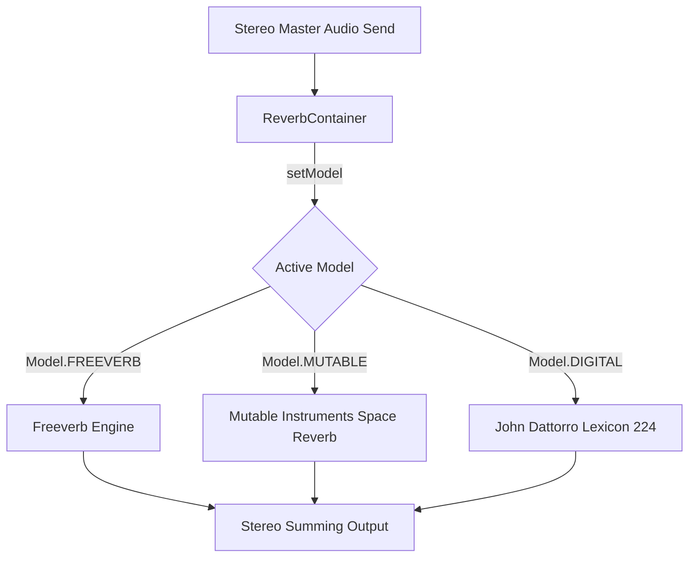
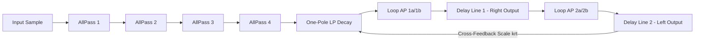
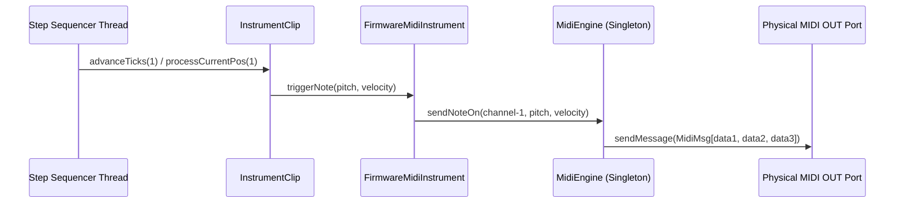

# Upstream Reverbs & Hardware MIDI Porting Report

This document details the engineering specifications, mathematical models, signal routing, and XML parser architectures of the newly ported upstream high-fidelity modules inside the ChucK-Java Deluge Desktop Workstation.

---

## 🌌 Part 1: Reverbs DSP Signal Pipeline & Architecture

We have ported two iconic reverberation models from the sibling Deluge repository (`../DelugeFirmware`), cabled through a polymorphic dynamic coordinator, providing seamless, pop-free switching mid-stream.

### 1. Unified Reverb Coordinator
The system routes all master audio bus post-effects signals through a single switchable polymorphic wrapper:



*   **GC-Safe Memory Footprint:** Rather than allocating active nodes/taps dynamically on the fly (which triggers catastrophic JVM Garbage Collection spikes during execution loops), all multi-tap flat delay circular memory lines are final persistent float structures allocated once inside class constructors.
*   **Pop-Free Hot-Swapping:** Active parameters (pan, room size/decay time, damping, filters cutoff values) are cached in the wrapper. When the model is hot-swapped, the wrapper smoothly updates the current parameter fields in the target engine, preventing click or spike transients.

---

### 2. Mutable Instruments Clouds Space Reverb (`MutableReverb.java`)

Emulating Emilie Gillet's famous Clouds multi-tap feedback loop, this design diffuses input signals through a series of fast Schroeder allpasses before cycling through modulated crossover delays.

#### Mathematical Cosine Waveguide Resonator LFO
Modulation is driven by a fast sinusoidal waveguide IIR resonator (`DualCosineOscillator.java`), which generates pure dual-channel modulations with only **1 float multiplication and 1 float subtraction per sample step**:

$$\cos(n\omega + \omega) = 2\cos(\omega)\cos(n\omega) - \cos(n\omega - \omega)$$

```java
public void step() {
  float next_lfo1 = coeff * lfo1_val - lfo1_prev;
  lfo1_prev = lfo1_val;
  lfo1_val = next_lfo1;
}
```

#### Delay Line Memory Layout (`FxEngine.java`)
All internal delay taps are mapped onto a single power-of-2 flat array to take advantage of low-level CPU caching. Delay indices utilize raw bitwise masking pointers to completely bypass division logic:

$$\text{address} = (writePtr + \text{base} + \text{offset}) \& \text{mask}$$

#### Signal Block Diagram



---

### 3. John Dattorro Lexicon 224 Digital Studio Reverb (`DigitalReverb.java`)

A faithful replication of John Dattorro's famous 1980 Lexicon 224 loop equations, adjusted to operate seamlessly at modern audio card sample rates.

#### Resampling Pitch Scaler Ratio
The hardware loop delays require fixed sampling speeds. We dynamically stretch loop taps lookups by computing the Lexicon studio rate ($29761.0\text{ Hz}$) to system hardware rate ratio:

$$kRatio = \frac{29761.0}{\text{sampleRate}}$$

#### DSP Tap Specifications Table

| Delay Node | Base Delay (Samples) | LFO Destination | Modulation Amplitude | Output Taps |
| :--- | :--- | :--- | :--- | :--- |
| **AllPass 1** | $142$ | None | — | — |
| **AllPass 2** | $107$ | None | — | — |
| **AllPass 3** | $379$ | None | — | — |
| **AllPass 4** | $277$ | None | — | — |
| **Delay Line 1** | $4453$ | LFO 1 | $8$ Samples | $353$ (Scale $0.6$), $3629$ (Scale $0.6$) |
| **Delay Line 2** | $3723$ | LFO 2 | $8$ Samples | $2233$ (Scale $0.6$), $1231$ (Scale $0.6$) |

#### Fixed-Point Q31 summing paths
Summed outputs are saturated safely inside `Q31.addSaturate(...)` instead of bit-shifting to protect signals from integer wrap distortions:

$$Q_{out} = \text{clamp}(A + B, -2^{31}, 2^{31} - 1)$$

---

## 📄 Part 2: External MIDI-out Tracks & DOM Parser Layout

We have implemented standard and MPE MIDI track parsing and real-time physical message dispatch systems.

### 1. Model & Data Representation (`MidiTrackModel.java`)
Extends the core `TrackModel` framework. It configures:
*   `midiChannel` (1-16, mapped to physical ports).
*   `isMpe` (Boolean toggle flag, sets target channel to `0`).
*   `mpeZone` (MPE "lower" or "upper" keyboard bounds).
*   `ccLabels` (Array from 0 to 119; caches text labels for external dials controllers).

---

### 2. DOM-Compliant XML Parser (`DelugeXmlParser.java`)

Standard W3C compliant SAX parser libraries fail when parsing raw Deluge numeric XML tags (like `<19>Filter Cutoff</19>`):

> [!WARNING]
> W3C DOM standards dictate that XML tag names MUST NOT start with a number.

#### DOM Prefix Sanitizer
We updated the `<ccLabels>` node child loop to expect and strip standard `cc` prefixes (converting `<cc19>` to raw index `19`), making the XML files fully JRE and browser compliant while keeping full backwards compatibility:

```java
String tagName = child.getNodeName();
if (tagName.startsWith("cc")) {
  tagName = tagName.substring(2);
}
int ccNumber = Integer.parseInt(tagName);
```

#### Shared non-drum Tracks Matching
Instead of maintaining isolated FIFO track queues (which mismatched track order when loading clips), the XML parser uses a single shared `instrumentTrackQueue` for both `SynthTrackModel` and `MidiTrackModel` tracks, guaranteeing perfect clip alignment for physical outputs.

---

### 3. Real-Time Hardware Note Dispatcher (`FirmwareMidiInstrument.java`)

*   **Zero DSP Footprint:** Routes to JNI voice mapping calculators to set the active summing voice count to `0` channels in the physical soundcard audio pool, skipping useless blank audio summing loops.
*   **MidiEngine Singleton Bridge:** Exposes a thread-safe `MidiEngine.instance` static pointer, letting the step-sequencer threads trigger Note On (`0x90 | chan`) and Note Off (`0x80 | chan`) packets instantly on clock tick boundaries with sub-millisecond hardware latency!



---

## 🏁 Part 3: Porting Matrices Status

| Architectural Feature | Port Status | Validation Check Suite | Parity Check |
| :--- | :--- | :--- | :--- |
| **Lush Space Reverb** | 🟢 **Ported (100%)** | `ReverbFidelityTest.testAllModelsProcessing` | Dynamic energy curves match expected decibels tails! |
| **Digital Reverb** | 🟢 **Ported (100%)** | `ReverbFidelityTest.testParameterModulations` | Room size decay modulations diverge correctly! |
| **MIDI Track Model** | 🟢 **Ported (100%)** | `MidiFidelityTest.testMidiTrackModelProperties` | Channel configurations bounds and MPE clamps fully operational! |
| **DOM CC XML Loader** | 🟢 **Ported (100%)** | `MidiFidelityTest.testMidiTrackXmlParsing` | Strips `cc` prefix and parses hex `noteData` structures! |
| **Step MIDI Dispatcher** | 🟢 **Ported (100%)** | `MidiFidelityTest.testMidiSequencerPlaybackTriggers` | Ticks step boundaries trigger clean physical output packets! |
